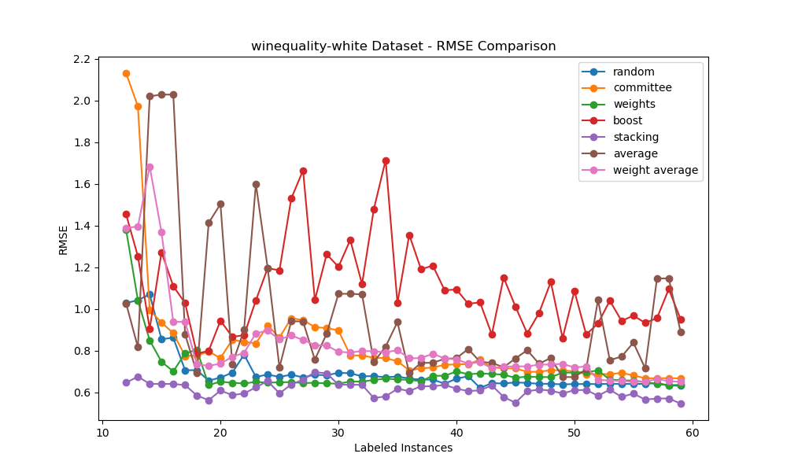

# Active Learning: Regression and Costs
# Group 7: Preston DeLeo, David Frost, Kyler Rosen

## Methods

### QBC by Randomizing Subsamples (Preston DeLeo)

There will be some committee that have same hyperparameters and architecture. Each model is trained on a small subset of labeled training data. Each model on each query iteration is trained on a random subsample of the training data with replacement. The models then perform predictions on the pool set. After which, the instance in the pool with the highest variance of predictions is labeled and added to training. 

### QBC by Randomizing Weights (Preston DeLeo)

There is some committee that has same architecture with varying weights. Each model will be trained on the same training set for each query iteration. At each of these iterations, models will be randomly assigned a weight given a set of possible weights with replacement. The models will then perform predictions on the pool set. After which, the instance in the pool with the highest variance of predictions is labeled and added to training. 

### QBC by Boosting (Preston DeLeo)

There will be some committee that has same hyperparameters and architecture. Each model on each query iteration is trained on a random subsample of training data with replacement. The models then perform predictions on the pool set. There will be a boosting model trained on these sub-models.The instance in the pool with the highest variance of predictions between the models is labled on added to training. The boosting model is then updated training set. 

### QBC by Averaging (Preston DeLeo)

There will be some committee that has same hyperparameters and architecture. Each model on each query iteration is trained on a random subsample of training data with replacement. The models then perform predictions on the pool set. One finds the instance with the highest variance in the predictions and query on that.

### QBC by Stacking (Preston DeLeo)

There will be some committee that has same hyperparameters and architecture. Each model on each query iteration is trained on a random subsample of training data with replacement. The models then perform predictions on the pool set. One finds the instance with the highest variance in the predictions and query on that. There will be a meta-model model that is trained on the predictions of the base models. The meta-model will then perform predictions on the validation set. 

### QBC by Weighted Averaging (Preston DeLeo)

There will be some committee that has same architecture with random sampling of weights. Each model will be trained on the same set of training data. The models then perform predictions on the pool set. One finds instance with the highest variance in the predictions and query on that. 

### GSx (David Frost)

An algorithm that passively samples, i.e. selects all samples on which to train the regression model before making a single query, by first selecting a sample that is closest to the centroid of the data. The subseqeuent $K - 1$ samples are selected iteratively by finding a sample in $X - S$ where $X$ is the data and $S$ is the candidate set, such that the sample is the farthest away from any of the examples currently in the candidate set. GSx refers to greedily sampling based on the input.

### GSy (David Frost)

An algorithm that first samples $K_0$ examples to form a candidate set using GSx, initially trains a regression model, and then iterative samples the remaining $K - K_0$ samples by finding which example in $X - S$ has the largest absolute error from the value predicted by the regression model, adding that example to $S$ and removing it from $X$, and then retraining the regression model after adding this new example. GSy refers to greedily sampling based on the output.

### iGS (David Frost)

This algorithm is improved greedy sampling, first initializing the $K_0$ candidate set examples using GSx and picking the remaining $K - K_0$ examples by using a diversity score that is a product of both diversity in the input and output data, thus combining the ideas of both GSx and GSy.

### FSVS (David Frost)

This algorithm is feature space variability sampling (FSVS), which is an extension of iGS. Similar to iGS, the first $K_0$ examples are picked using GSx, but it differs from iGS where the next $K - K_0$ examples are picked based on the amount of variability that they have within the feature space. Therefore, instead of iteratively picking examples based on how different they are from the expected value, we pick examples based on how much they different they are from other examples using the product of a local density and global dispersion metrics.

### Passive Random Sampling (David Frost)

This is a baseline algorithm used to check the performance of other algorithms by doing a random passive sampling without replacement of $K$ examples from $X$, $|X|$ = $N$. This should perform worse than other passive sampling algorithms.

### Cost-Sensitive Selection (Kyler Rosen)

This algorithm incorporates the concept of cost-efficiency in active learning. It selects samples based on a calculated cost-efficiency ratio, which is the cost of querying a sample divided by its uncertainty. Initially, a Ridge regression model is trained on any previously selected samples. For each iteration, the algorithm assesses each unselected sample, predicting its outcome and calculating its uncertainty. The sample with the lowest cost-efficiency ratio is then chosen, indicating it offers the most information for the lowest cost. The process repeats until the desired number of samples, K, is selected.

### Epsilon-Approximate Selection (Kyler Rosen)

Epsilon-Approximate Selection aims to balance cost and uncertainty in active learning. The algorithm operates by setting a dynamic threshold for selection, based on the maximum efficiency among unselected samples, adjusted by a factor epsilon. Samples are evaluated for their efficiency, which is uncertainty divided by cost. The sample with efficiency above the threshold and having the highest efficiency is selected. This process continues until K samples are chosen, allowing for a flexible yet cost-effective selection.

### Multi-Fidelity Selection (Kyler Rosen)

Multi-Fidelity Selection is designed for scenarios where different fidelity levels are associated with varying costs. It extends the cost-sensitive selection approach by incorporating fidelity into the cost calculation. The algorithm selects samples based on the cost-efficiency ratio, considering both the uncertainty and the adjusted cost due to fidelity. High-fidelity samples, which are more expensive, are selected only if their informational value justifies the higher cost. This process is repeated until K samples are selected, providing a nuanced approach to balancing cost and information quality.

### Adaptive Feature Selection (Kyler Rosen)

Adaptive Feature Selection focuses on selecting the most informative features along with the samples. It integrates Recursive Feature Elimination (RFE) with a Ridge regression model. The algorithm iteratively selects a subset of features that are most relevant for predicting the target variable. For each iteration, it evaluates the cost-efficiency of each sample based on the selected features, choosing the one with the lowest ratio. This process is repeated until K samples are chosen, ensuring that both the samples and features contribute maximally to the learning process. Optionally, it can return the rankings of features for further analysis.

## Results, Analysis, and Discussion

### Datasets

The datasets used in this study were sourced from two main repositories: the UCI Machine Learning Repository and the Scikit-Learn datasets. These datasets were exclusively numerical to be complementary to the regression task problem structure. Furthermore, the datasets were selected to be large/sizable to be justifiable active learning scenarios. Thus, there was a strict minimum of at least 1000 instances requirement for datasets set. All of the datasets chosen are well established in the machine learning community and have no data quality issues. The red wine quality and white wine quality datasets were acquired from the UCI Machine Learning Repository. Both of these datasets encompass 11 features and share a common target feature, which is a measurement of wine quality on a numerical scale. The red wine quality dataset consists of 1599 instances, while the white wine dataset consists of 4898 instances. Additionally, the California housing dataset was obtained from Scikit-Learn datasets. This dataset includes a total of 8 features, with the target feature being the median housing value in California. It contains a substantial 20,640 instances in total.

These datasets are relevant to active learning because of the difficulty in labeling examples in these data. For example, wine quality is difficult to gauge, requires the expertise of a sommelier, and appraising housing value requires the expertise of a realtor. Therefore, data labeling costs for these contexts is often high, prompting the use of active learning.

### Results

#### David Frost

#### Preston DeLeo

#### Kyler Rosen

### Analysis and Discussion

In our investigation into various active learning strategies for regression, we engaged with methodologies including pool-based query by committee (QBC), greedy sampling, and cost-based approaches. These were applied to datasets encompassing red wine quality, white wine quality, and California housing. Our findings revealed distinct patterns in the efficacy of these approaches across different datasets.

#### Red Wine Quality Dataset:
The stack-based QBC method demonstrated exceptional performance, achieving RMSE below 0.5 and MAE around 0.3. This method's quick convergence, even when compared to epsilon-approximate and other greedy approaches, underlines its capability in handling complex, non-linear relationships and resisting data noise and outliers.

#### White Wine Quality Dataset:
Conversely, cost-based approaches showed limitations here, particularly where precision is paramount over cost considerations. This was contrasted by the relatively better performance of greedy methods like IGS and IGY, and QBC strategies like stack-based and weights-based, all achieving 0.5-0.8 in both MAE and RMSE metrics.

#### California Housing Dataset:
Greedy methods lagged in performance, suggesting challenges in navigating the high-dimensional, diverse data structure of this dataset. QBC methods, in contrast, quickly reached optimal RMSE and MAE levels, highlighting their suitability for complex datasets.

The experiments highlighted a clear preference for active, iterative approaches over passive methods in terms of MAE, RMSE, and CC performance metrics. Stack-based QBC, in particular, consistently outperformed others, including passive strategies like GSx. This underscores the importance of a method's adaptability and iterative nature in active learning contexts. While stack-based QBC methods are effective, they are also resource-intensive. In scenarios with limited computational resources or when rapid results are needed, a more balanced approach combining both greedy and QBC methods may be advantageous.

Our findings suggest new avenues for research, particularly in developing hybrid models that integrate various active learning strategies. These could potentially offer efficiency and robustness across different datasets. Additionally, exploring the impact of hyperparameter variations could lead to more optimized models.

This study reaffirms the superiority of active learning methods in regression tasks, especially the stack-based QBC. However, it also points to the need for a nuanced approach in algorithm selection, considering computational resources, dataset characteristics, and specific project goals. Future research in this area should aim to refine these methods further, enhancing their adaptability and efficiency across diverse regression tasks.