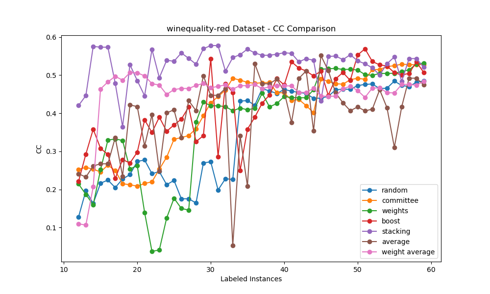
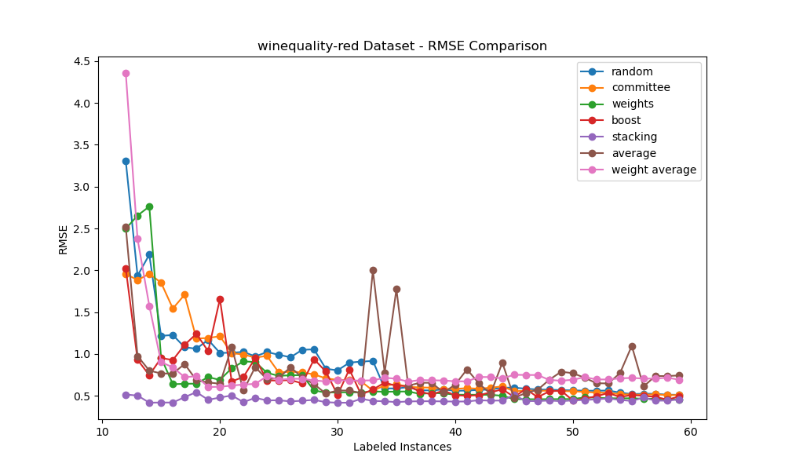
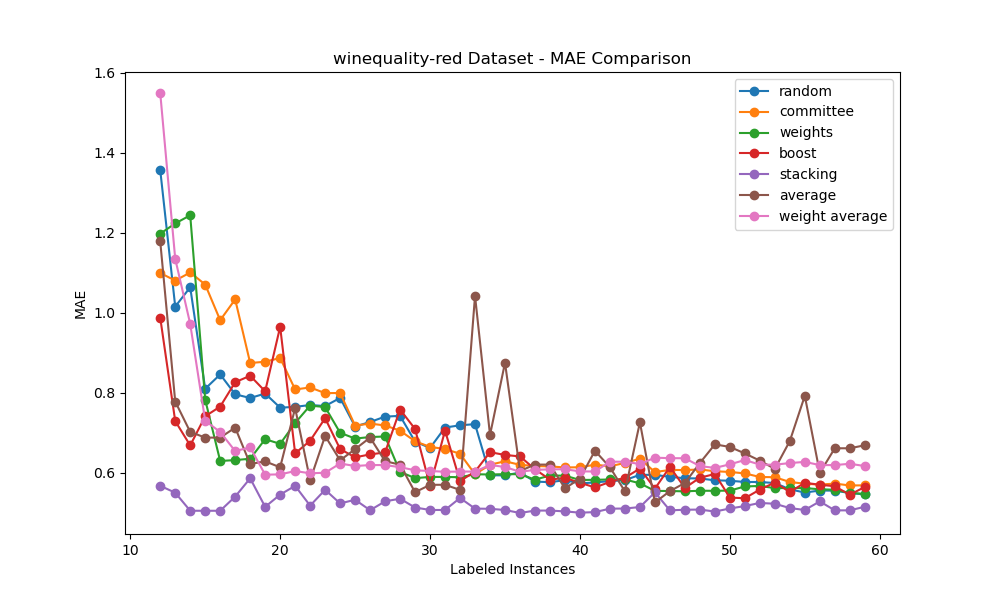

# Final Project Individual Report CSDS 440
# Preston DeLeo: Pool-Based Active Learning for Regression via Query By Committee

## Survey

### Seed Paper Review
Active learning is an area in machine learning in which the learner is allowed to query its own data to learn from (Settles, 2009). This stems from the idea that given this framework, the learner can perform better as a model with less training data. The motivation behind this is that datasets often have large quantities of unlabeled data. The labeling of this training data for models is an arduous task that can be in many cases costly (Settles, 2009). Thus, active learning is deployed to minimize the amount of data for training while achieving adequate performance. There are three types of active learning: membership query synthesis, stream-based selective sampling, and pool-based active learning. In membership query synthesis, the learner can receive any label for an unlabeled instance in the input space it queries. In stream-based sampling, unlabeled instances are drawn sequentially/one at a time and the learner makes a decision whether or not to query on the instance. In pool-based, queries are drawn from a large pool of unlabeled instances usually based on a greedy approach. In all three of the main strategies of active learning the learner queries off of some informative measure. There are a variety of sample methods that are too vast to enurmerate here. An important note though in these methods is that there seems to be significantly less work in the query by committee (QBC) approach. The paper only mentions ensemble techniques such as bagging and boosting but says nothing about the utility of other approaches such as stacking and arcing. Another important point highlighted in this survey is that most of the literature concerning active learning is in the frame of classification tasks. In contrast, there is little to any work done in the space of regression tasks. Furthermore, many approaches from classification tasks cannot be applied for regression tasks. Because of this, I proposed to my machine learning group for us to explore active learning for regression tasks. In this project, various techniques and methods in the area of active learning for regression will be researched. For my research, pool-based active learning for regression using query by committee will be explored.

Query by committee in pooling is in essence querying the pool for instances that have the highest disagreement among learners (Settles, 2009). Each learner on the committee is said to be representative of some hypothesis. In selecting the instance of maximal disagreement, one is minimizing the set of hypotheses that conform to the training data i.e. the version space. 

Thus, the implicit goal of this strategy is to continuously constrain the version space regions given n number of queries to find an optimal learner/model. In normal classification tasks, pool-based query by committee has a large swath of informative sampling methods and measurements to determine this disagreement. However, Settles does not highlight the challenges in context of regression. For regression tasks, this notion of consensus and disagreement is much less apparent. One can easily determine uncertainty via tabulation of class probabilities in a discrete case but one does not have this luxury for the continuous case. One has to resort to less straightforward measures such as variance. The range of the predicted values of the target is on a continuous range rather than a set number of classes. This again makes producing an accurate model less obvious than in classification.

 In the literature, active learning for regression through query by committee has relied entirely on variance for an informative measure to disagree on as it is a clear statistic to encapsulate uncertainty (Burbidge et al., 2007). There have been only two main ways in the literature to perform QBC for active regression that differ based on where the variation in the machine learning model is embedded through randomization (Burbidge et al., 2007). Thus, I am only able to implement two algorithms but I will supplemnet this with more extensions. The more popular of the two approaches was conceived by RayChaudhuri and Hamey. In this approach, the authors attempted to induce variation in the system via what some may describe as a pseudo-bagging approach where variation is derived from the randomization in ensemble data. In the second and lesser known approach by Krogh and Vedelsby, where this variation in the model was derived from the randomization of weights in the neural network ensembles. The neural networks, though trained on the same data, were able to generate a diveristy in prediction. The randomization through data is the standard approach though, from reading the papers, it seems to be little justification for why one ought to choose one approach over another. 

### Paper 1 Review: Minimisation of data collection by active learning 
 The motivation behind RayChaudhuri and Hamey's paper was minimizaition of both generalization error and the amount of data needed to train a given model. In their approach, they utilized query by committee with similar approach to bagging. Each model is trained on a random subsample of labled data. The assumption was that this embedding of randomization would cause learners to disagree and then one could begin the process of querying each iteration to minimize the disagreement. RayChaudhuri and Hamey asserted that this approach is more efficent than that of Krogh and Vedelsby as less data is needed. RayChaudhuri and Hamey generated an ensemble of ten neural network learners trained on unique randomized subsample of ten data points. At each query, the data point that the neural networks had maximal variance was selected. This was done to excitate the previously mentioned idea...stepping toward convergence of agreement. This data point of maximal variance is then added to the training set. They continued this querying process until it a hit a preset threshold of 0.001 in model variance. In comparison to passive learning, their new approch was significantly better to passive learning on number of queries vs performance (given data was not extremely high noise). From this, one can say that this version of QBC ought to be worthwhile as long as number of queries does not blow up and noise of the data is moderate. In later implementations of their work by others, often thresholding (acknowledgement of agreement) was done via a maximum number of queries as again the rate of convergence to a given variance level would be variable. Though this paper is short, it is possibly the most influential and accepted QBC methodology in the literature for active regression. A final remark should be made that they in fact give little empirical evidence of the supremacy of their methodology over Krogh and Vedelsby. In addition to this, the authors give no clear theoretical and or mathematical justification alsop. This compels me to the test the performance of the two to make an adequate determination.

### Paper 2 Review: Network Ensembles, cross validation, and active learning
 The motivation behind Krogh and Vedelsby's paper was to quantify disagreement in ensembles in regression tasks, specfiially in the context of active learning. Krogh and Vedelsby justify the notion of ambiguity as the variation between ensemble output on unlabeled samples. 

They define ambiguity as the following:

$\bar{A}(x) = \sum_{\alpha} w_{\alpha} A^{\alpha}(x) = \sum_{\alpha} w_{\alpha} (V_{\alpha}(x) - \bar{V}(x))^2$  (variance of commmittee member predictions)

where V bar denotes a weighted ensemble average.

 The paper itself explores many different areas relating to this concept such as bias-variance tradeoff, cross validation, etc. However, the important part of the paper that is often seemed as a footnote is how Krogh and Vedelsby embedded disagreeement into these ensemble systems. The disagreement in the ensembles actually comes from the random initialization of the weights in the neural networks. They note that randomization via subsamples without rpelacement can generate ambiguity but at the expense of generalization error. Thus, by avoiding this scenario all together there is a hypothesis that generalization error will not be hurt.

 Krogh and Vedelsby use ensemble variance as a notion of generalization error. All of the models, five neural networks, are trained on the same random subset of data. At each query when identifying an instance to label, the generalized 'algorithm' chooses on the instance with maximal variance. They were able to achieve a significant improvement from the base line random passive sampling. This paper offers a novel approach to generate successful disagreement among learners while not risking generalization error. One can now see the difference of approach between the two papers. Krogh and Vedelsby were more focused on preventing reduction of generalization error while RayChaudhuri and Hamey had a focus on minimizing the amount of trianing data utilized as much as possible. 

### Ridge Regression
    
In the following implementations of the algorithms, the model architectures will be ridge regression. Ridge regression was chosen as the regularization of the coefficients (L2) in this model helps prevent unwanted overfitting that other regression models may suffer from the limited data. Ridge regression is also computationally efficient with respect to other more complex regression models which is a desirable trait in active learning.

Ridge Regression Objective Function: $||y - Xw||_2^2 + \alpha ||w||_2^2$

The equation above specifies the objective function. The left side of the equation represents the ordinary least squares difference between the actual and predicted target feature. The right side of the equation denotes the penalty term (L2) to reduce overfitting. As one can see, the hyperparamter setting of alpha will play a crucial role in the degree to which the model fits to the data. 

## Methods

### Algorithm #1, Paper 1, Description Based on Randomizing Subsamples:
 There will be some set of initialized models, the committee, that are the same with respect to their hyperparameters and architecture (all ridge regression models with alpha of 0.01). Each model is trained on a small set of labeled training data. Each model on each query iteration is trained on a random subsample of training data with replacement similar to a bagging approach. The models then perform predictions on the pool set. After which, the instance in the pool with the highest variance of predictions between the models is chosen to be labeled and added to the training set. A new model is constructed with the updated training set and runs on the validation set. The algorithm checks whether or not to stop at each iteration based on some stopping criterion. In my implementation, the stopping criterion is simply some preset maximum number of queries allotted.

###  Algorithm #2, Paper 2, Description Based on Randomizing Weights:
 In my construction of the algorithm, I adapted paper two slightly for the ridge regression model. Paper two randomized the model via randomizing the weight of the neural network ensemble while I will be randomizing via the alpha hyperparameter. The alpha hyperparameter in ridge regression has much more of an influence on the training process than weights (given not initialized with high magnitude). This is because alpha determines the scaling of the regularization term… how much we want to control overfitting of the training data (bias variance tradeoff). Furthermore, the weights are adjusted throughout the process and will converge to a solution that minimizes loss. 
The algorithm will work as follows: There will be some set of initialized models, the committee, that are the same with respect to their architecture with varying hyperparameters (alpha). Each model will be trained on the same entire training set for each query iteration. At each of these iterations, models will be randomly assigned an alpha given a set of possible alpha values with replacement. The models will then perform predictions on the pool set. After which, the instance in the pool with the highest variance of predictions between the models is chosen to be labeled and added to the training set. A new model is constructed with the updated training set. The algorithm checks whether or not to stop at each iteration based on some stopping criterion. In my implementation, the stopping criterion is simply some preset maximum number of queries allotted.  

## Research

### Research Extension #1 Based on paper 1:
My motivation for this research extension was the lack of literature on utilizing boosting. It seems that given that these models are trained on a small random subset of data, this conforms with the boosting hypothesis (generating a strong learner from a set of weak learners). Some mentioned that boosting may not be the best approach in the literature, so this was also an exploration into the current assumptions about this potential approach.

The proposed algorithm works as follows: There will be some set of initialized base models, the committee, that are the same with respect to their hyperparameters and architecture (all ridge regression models with alpha of 0.01). Each model on each query iteration is trained on a random subsample of training data with replacement similar to a bagging approach. The models then perform predictions on the pool set. There will be a boosting model, specifically Adaboost, trained on these sub-models. After which, the instance in the pool with the highest variance of predictions between the models is chosen to be labeled and added to the training set. The boosting model is then fully constructed with the updated training set. The algorithm checks whether or not to stop at each iteration based on some stopping criterion. In my implementation, the stopping criterion is simply some preset maximum number of queries allotted.

### Research Extension #2 Based on paper 1:
 My motivation for this research extension algorithm was in the knowledge that in the problem structure we are trying to reduce variance. One of the common techniques in variance reduction for ensemble learning in classification is simply averaging the predictions of the models and taking them. In the literature I was not able to find any instance of this being used in active learning for regression.

The proposed algorithm works as follows: There will be some set of initialized base models, the committee, that are the same with respect to their hyperparameters and architecture (all ridge regression models with alpha of 0.01). Each model on each query iteration is trained on a random subsample of training data with replacement similar to a bagging approach. The models then perform predictions on the pool set. After which, one will find the instance with the highest variance in the predictions and query on that. Each model will perform predictions on the validation set and the average of the models will be the predictions on the validation set. The algorithm checks whether or not to stop at each iteration based on some stopping criterion. In my implementation, the stopping criterion is simply some preset maximum number of queries allotted

### Research Extension #3 Based on paper 1:
 My motivation for this research extension algorithm was realized from exploiting the definition of active learning. At the core of active learning, it is about being able to perform well with limited labeled data rather than data itself. From this notion, I constructed an idea to ‘extend’ the learning process at each step. At the root of the central limit theorem one can say that as the sample size increases, the mean is a more accurate estimate of the population. Thus, instead of using the models as predictors one could use them as ad-hoc supplementary data for training. This will solve our labeled data bottleneck as we increase our labeled data with a significant order of magnitude. 

 The idea is to generate another set of data using stacking on a set of the learning models. The model ought not overfit as variance is reduced in base models through the random sampling of their data (same as the first algorithm). Furthermore, it should probably overfit less than and perform better than the previously proposed boosting model. The problem is that the boosting model given the small subset is more susceptible to issues such as overfitting. Furthermore, one should not get diminishing returns from this process as the base models are not likely to be well regularized from the limited data. To the best of my knowledge, this is novel and this has never been applied to active learning for regression. 
 The proposed algorithm works as follows: There will be some set of initialized base models, the committee, that are the same with respect to their hyperparameters and architecture (all ridge regression models with alpha of 0.01). Each model on each query iteration is trained on a random subsample of training data with replacement similar to a bagging approach. The models then perform predictions on the pool set. After which, one will find the instance with the highest variance in the predictions and query on that. There will be a ridge regression meta-model model that is trained on the predictions of the base models. The meta-model will then perform predictions on the validation set. The algorithm checks whether or not to stop at each iteration based on some stopping criterion. In my implementation, the stopping criterion is simply some preset maximum number of queries allotted. 

### Research Extension #4 Based on paper 2: 
 My motivation for this research extension algorithm was again the same as the second research extension. The knowledge that in the problem structure we are trying to reduce variance. One of the common techniques in variance reduction for ensemble learning in classification is simply averaging the predictions of the models and taking them. In the literature I was not able to find any instance of this being used in active learning for regression.

 The proposed algorithm works as follows: There will be some set of initialized base models, the committee, that are the same with respect to their architecture with random sampling of alpha values (same as the second algorithm). Each model will be trained on the same set of training data. The models then perform predictions on the pool set. After which, one will find the instance with the highest variance in the predictions and query on that. Each model will perform predictions on the validation set and the average of the models will be the predictions on the validation set. The algorithm checks whether or not to stop at each iteration based on some stopping criterion. In my implementation, the stopping criterion is simply some preset maximum number of queries allotted. 

## Results, Analysis and Discussion

 Average correlation coefficient, RMSE, and MAE for 100 runs were collected on all seven of the query by committee algorithms. On each dataset, the models were bootstrapped with a minimum number of training instances (minimum between 20 and number of features + 1). The maximum number of training instances (maximum between 60 and size of dataset). The difference between the maximum and minimum are the total number of possible queries alloted to the learner for training. For models were alpha was not randomized it was preset at 0.01. The number of models for an ensemble was set fixed to 5. There were in total seven algorithms compared: random querying, weighted QBC, committee (pseudo-bagging/randomizing data) QBC, boosting QBC, stacking QBC, weighted averaging QBC, and averaging QBC. I obviously do not include the baseline passive strategy as an extension as it is trivial. Note that CC means correlation coeffient, MSE is mean squared error, and MAE is mean absolute error.

### Algorithms in Papers on Red Wine Dataset

### Algorithms in Papers on White Wine Dataset

### Algorithms in Papers on California Wine Dataset

### All Algorithms on Red Wine Dataset

### All Algorithms on White Wine Dataset

### All Algorithms on California Housing Dataset

### Analysis and Discussion

 On the red wine dataset, the initial correlation coefficeints between algorithms varied but eventually stablized at the end of the training process between 0.5 an 0.6. The averaging algorithm and weights algorithms are very sparatic in the correltaion coefficent trend as number of samples increase. This suggests that they may have selected noisy examples in their training process. The stacking and weighted average methods seem to achieve high and stable correlation coefficients quickly. This suggest that they were able to learn the complex relationships affectively Bothe of the averaging methods seemed to have extremely sparatic CC as labeled instances increase. this extreme variation in the models. 

 In the case of RMSE and MAE, it seeemed that the stacking approach proved to be the most effective as achieving a somewhat optimal RMSE almost instanteously. Approaches such as weighting and average were able to achieve a reasonable RMSE and MAE quickly. Most approaches eventually converged to the training process 0.6, however this was after much instability and queries. The averaging strategy and  

 On the white wine dataset, the intial correlation coefficients varied but eventually gradually increased. The averaging and boosting algorithms had noticeable more instability than any other algorithms. This is indicative that these strategies may have struggled understanding the relationships of the data. Stacking once again achieved the highest correlation coefficient and was stable followed by random sampling. 

 In regards to RMSE and MAE, stacking was able to outperform all other algorithms and quickly converge. Apart from itself and the weighting algorithm, the algorithms performed worse than the random sampling baseline. This means that these algorithms were not affective at the regressino task on the dataset.

 On the california housing dataset, most algorithms apart from averaging generally had an upward trend in correlation coefficient as labeled instances increased. The original committee algrithm and weighting algorithms noticeably achieved a high correltaion coefficent and asymptoted quickly. In regards, to RMSE and MAE, stacking again outperformed all other models and converged immeaditely. committee and weighting were also able to achieved a stable and relatively good values quickly.

 When looking at all of these plots as whole there are some very interesting metrics to be found. Averaging and boosting were found to be extremely unstable with respect to reduction in RMSE and MAE. This makes sense for averaging, as if there is one really poor performing classifier it brings down the overall prediction power significantly because the mean is suspecitble to influence from outliers. Weighted averaging also suffered from this instability but to a much lesser extent. Suprisingly, boosting seemed to be a poor performer especially considering it being somewhat more computationally expensive than the rest of the models. 

It seems that the stacking approach proved to be the best in quick and stable error reduction. This performance is at a cost as the stacking algorithm takes significantly longer to run than the rest. A reason for why stacking outperforms boosting could be because boosting is more sensitive to outliers as a given model is supposed to improve upon its predecessors. Stacking attempts to generalize and minimize individual models defects (reduce bias and variance). Comically, the main downside to stacking (large data), is avoided in this active learning regression scenario. Furthermore, if one is not concerned with speed and instead with label costs, it seems that stacking is a clear choice. However, if someone is more concerned with speed, then the two standard algorithms (weights and committee) may be the stable solutions as long as one is fine with a sizable performance reduction. To add on to this, through this experiment there seems to be no conclusive evidence that the randomization of subsampled data is a more effective approach than randomization of weights. 

  In conclusion, the stacking and weighted averaging research extensions were found to be successful... much needed new novel querying strategies were developed. It was determined that there was no conclusive evidence that the randomization from subsampling was a better methodology than randomization via weights. It seems boosting is a net negative querying strategy when weighing in predictive power and computational cost. The averaging strategy is a definitive poor performer and ought to be avoided or combined with another ensemble method to mitigate its drawbacks. In the future, more extensive work should be done with this combination approach of stacking and other ensemble methods for active regression in query by committee. There should also be work into the affect of varying the types and size of models. It is quite possible some of the these model underperformed. It is quite possible that many of the strategies could achieve a lower RMSE and MAE given more optimal hyperparameters, different models, or a larger number of models. As Settles' paper noted, there is little consensus in the literature on these three factors affecting the ensemble so it may be indeed a worthwhile avenue. 

## Bibliography

 Settles, B. (2009) Active Learning Literature Survey. Computer Sciences Technical Report 1648, University of Wisconsin-Madison.

 Robert Burbidge, Jem J. Rowland, and Ross D. King. 2023. Active Learning for Regression Based on Query by Committee. In Intelligent Data Engineering and Automated Learning - IDEAL 2007: 8th International Conference, Birmingham, UK, December 16-19, 2007. Proceedings. Springer-Verlag, Berlin, Heidelberg, 209–218. https://doi.org/10.1007/978-3-540-77226-2_2

 RayChaudhuri,T.,Hamey,L.G.:Minimisation of data collection by active learning. In: Proceedings of the 1995 IEEE International Conference on Neural Networks. Volume 3., Perth, Australia (1995) 1338–1341

 Krogh, A., Vedelsby, J.: Neural network ensembles, cross validation, and active learning. In Tesauro, G., Touretzky, D., Leen, T., eds.: Advances in Neural Information Processing Systems 7, Denver, CO, The MIT Press (1995) 231–238 

